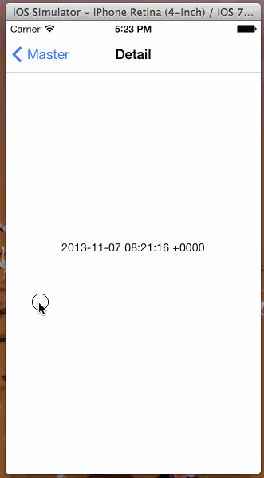

PanToBack
=========

Panning To Back Naivigating in  iOS App




Use
========

1. Initation

```objective-c
    PanToBack *backer = [[PanToBack alloc] init];
    [backer linkView:self.view];
    backer.delegate = self;
    backer.isDissabled = NO;
```

2. Delegate

```objective-c
- (void)back
{
    [self.navigationController popViewControllerAnimated:YES];
}
```
